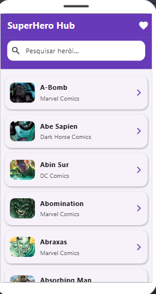
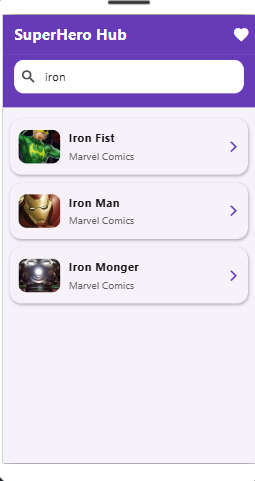
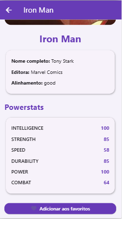
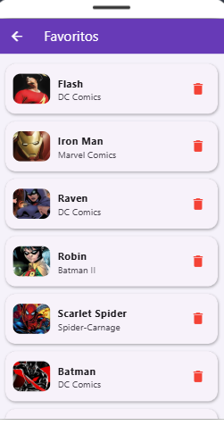

# SuperHero Hub - Flutter + Firebase

## 📌 Descrição do Projeto

O **SuperHero Hub** é uma aplicação desenvolvida em **Flutter** que consome dados da **SuperHero API** para exibir informações de super-heróis, como nome, imagem, editora, alinhamento e powerstats.

Além disso, a aplicação possui integração com **Firebase Firestore**, permitindo que o usuário salve heróis favoritos e os visualize posteriormente em uma tela dedicada.

Este projeto foi desenvolvido como trabalho individual acadêmico, atendendo aos requisitos de:
- consumo de API externa;
- integração com Firebase;
- organização de código;
- documentação no GitHub.

---

## 🚀 Funcionalidades

- Listagem de super-heróis
- Pesquisa de heróis por nome
- Tela de detalhes do herói
- Exibição de powerstats
- Salvamento de favoritos no Firebase Firestore
- Listagem de favoritos
- Remoção de favoritos

---

## 🛠 Tecnologias Utilizadas

- Flutter
- Dart
- HTTP package
- Firebase Core
- Cloud Firestore
- FlutLab.io
- SuperHero API

---

## 🌐 API Utilizada

**SuperHero API (Akabab):**

https://akabab.github.io/superhero-api/api

**Endpoint utilizado:**

https://akabab.github.io/superhero-api/api/all.json

---

## 🔥 Firebase Utilizado

- Firebase Core
- Cloud Firestore

O Firebase foi utilizado para persistência dos heróis favoritados.

---

## 📂 Estrutura do Projeto

```bash
lib/
 ┣ main.dart
 ┣ models/
 ┃ ┗ hero_model.dart
 ┣ services/
 ┃ ┣ api_service.dart
 ┃ ┗ favorites_service.dart
 ┣ screens/
 ┃ ┣ home_screen.dart
 ┃ ┣ detail_screen.dart
 ┃ ┗ favorites_screen.dart
 ┗ firebase_options.dart

assets/
 ┗ screenshots/
    ┣ busca.png
    ┣ detalhes.png
    ┣ favoritos.png
    ┗ tela_inicial.png
```

---

## 🧠 Arquitetura da Aplicação

```bash
Usuário
   ↓
Interface Flutter
   ┣ HomeScreen → lista e pesquisa de heróis
   ┣ DetailScreen → exibe detalhes e powerstats
   ┗ FavoritesScreen → mostra os heróis favoritos salvos
        ↓
Camada de Serviços
   ┣ ApiService → consome a SuperHero API
   ┗ FavoritesService → salva, lê e remove favoritos no Firestore
        ↓
Fontes de Dados
   ┣ SuperHero API (dados externos)
   ┗ Firebase Firestore (persistência de favoritos)
```

---

## ▶️ Como Executar o Projeto

### 1. Clone o repositório

```bash
git clone https://github.com/wlamilton/superhero-hub-flutter.git
```

### 2. Acesse a pasta do projeto

```bash
cd superhero-hub-flutter
```

### 3. Instale as dependências

```bash
flutter pub get
```

### 4. Execute o projeto

```bash
flutter run
```

---

## 📲 APK ou Versão Web

### Link para baixar o APK
[📥 Baixar APK](https://github.com/wlamilton/superhero-hub-flutter/releases/download/v1.0.0/superhero_app.apk)

## 📸 Prints da Aplicação

### Tela Inicial


### Pesquisa de Herói


### Tela de Detalhes


### Tela de Favoritos


---

## 📌 Observações

Este projeto foi desenvolvido no **FlutLab.io**, mas também pode ser executado em ambiente local com Flutter devidamente configurado.

---

## 👨‍💻 Autor

**wlamilton dos reis fidelis neto**
